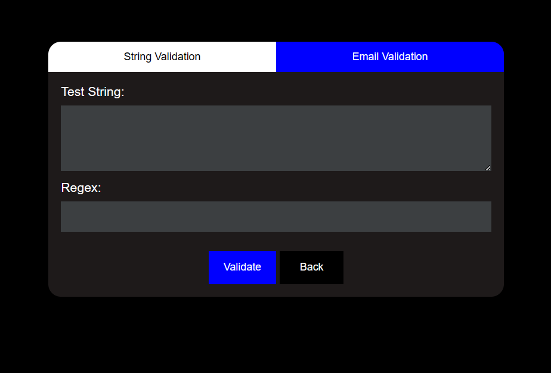
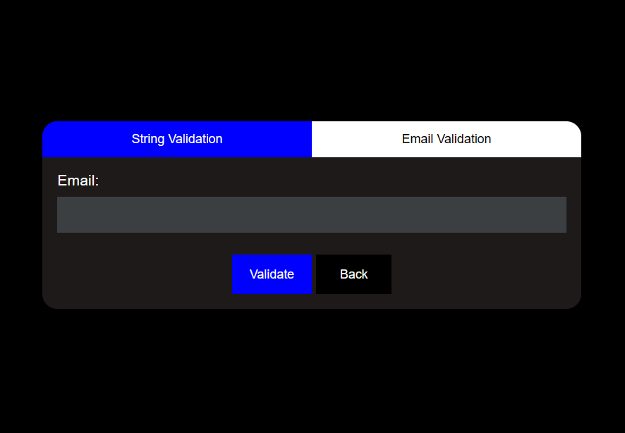
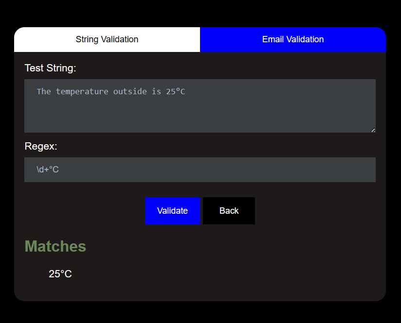
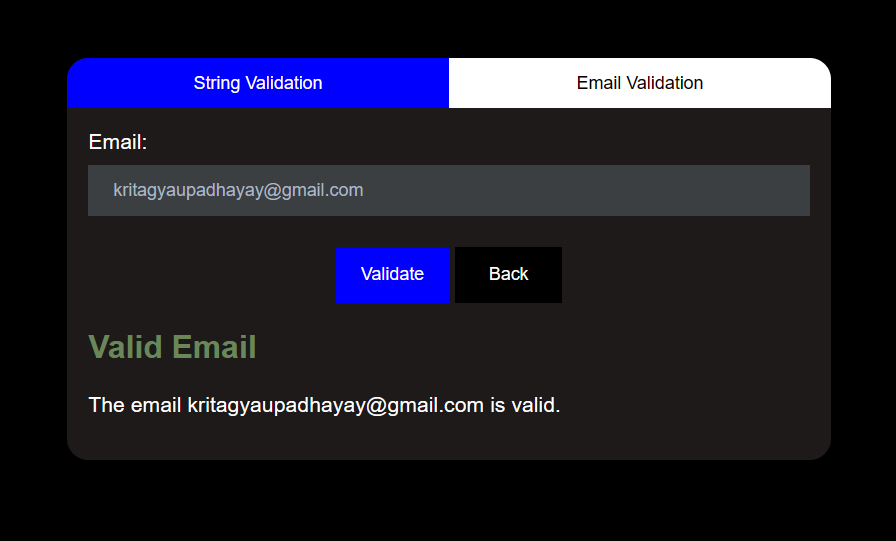

# Flask Regex Matcher Application

This repository contains a Flask web application that enables users to input a test string and a regular expression (regex) pattern to find matches within the test string. Additionally, it includes steps to deploy the application on an AWS EC2 instance.

## Getting Started

To use the application locally, follow these steps:

1. **Initialize the Flask Application:** Create a new Python file named `app.py`, import Flask, and define routes for the home page ("/") and form submission ("/results").
2. **Create HTML Template:** Design an HTML template named `index.html` with input fields for the test string and regex, and a submit button.
3. **Handle Form Submission:** Extract user inputs from the form data, perform regex matching, and store matched strings.
4. **Render Results:** Pass the matched strings to the HTML template for display.
5. **Test Your Application:** Run the Flask application locally and test with various inputs.

## Bonus Feature

Additionally, the application includes a route for email validation:

- **Validate Email Route:** Implement a route ("/validate-email") to handle email validation. Extract the email address from the form data, validate it using regex or a library, and return the validation result.

## Deployment on AWS EC2

To deploy the application on AWS EC2:

1. Provision an EC2 instance on AWS and SSH into it.
2. Clone the Flask application repository onto the EC2 instance.
3. Install dependencies, configure the application for production mode, and run it using Gunicorn.
4. Set up a web server like Nginx to serve the Flask application.
5. Configure security groups and network settings to allow traffic to the EC2 instance.
6. Access the deployed application using the public IP or domain name of the EC2 instance.

For detailed deployment instructions and best practices, please refer to the documentation provided by AWS.

## Result

**When any string is passed.**

**When the email id is passed.**

## License

This project is licensed under the [MIT License](LICENSE).
